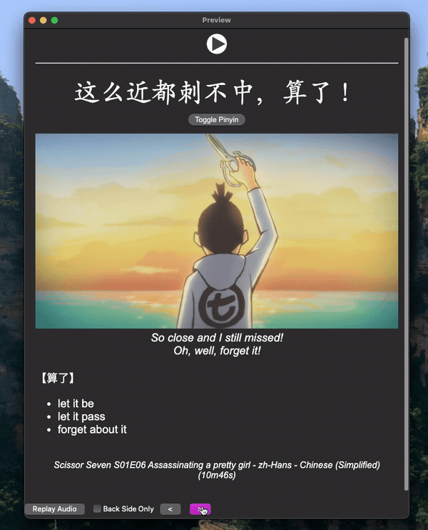
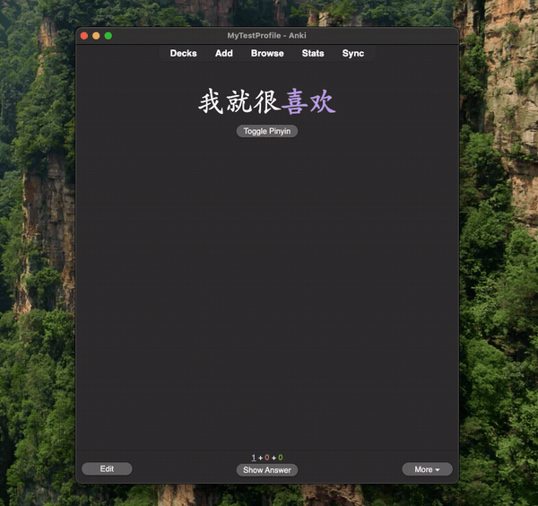
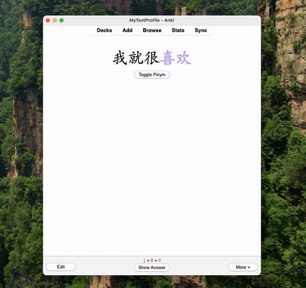

<h1 style="font-family: monospace;">Hanzi2Pinyin-notetype</h1>
<!-- GitHub Release -->

<pre>
Note type for <a href="https://github.com/alyssabedard/Hanzi2Pinyin" style="color: #9B83D5;">Hanzi2Pinyin</a>
</pre>

Really basic [Anki](https://apps.ankiweb.net/) note type to see ruby characters (pinyin, zhuyin, etc...) above chinese characters (hanzi).

    

[//]: # (    )

[//]: # (    )

## Usage
🚧 Documentation for non-technical users coming soon, please also  read [Hanzi2Pinyin](https://github.com/alyssabedard/Hanzi2Pinyin)

- Anki Note type (.apkg) under [Hanzi2Pinyin/note_type/](Hanzi2Pinyin/note_type)
- Individual files (html and css) under [Hanzi2Pinyin/individual_files/](Hanzi2Pinyin/individual_files)

##  Features
- Target expression/word are automatically highlighted for easy recognition
- Toggle ruby text:
  - View readings by hovering over specific characters or
  - Toggle button to display/hide all readings at once

## Anki Note Type Fields
| Field Name       | Usage                                                                          |
|------------------|--------------------------------------------------------------------------------|
| Expression       | Target word/expression  (Anki Sort Field)                                      |
| ExpressionPinyin | _Optional_                                                                     |
| ExpressionAudio  | Word/Expression audio                                                          |
| Sentence         | _Optional_                                                                     |
| SentencePinyin   | Sentence with ruby text (pinyin, zhuyin...)                                    |
| SentenceAudio    | Sentence audio                                                                 |
| Translation      | Native Language or second language translation of the sentence                 |
| Definition       | Meaning/definition of the expression/word                                      |
| Screenshot       | Screenshot/images                                                              |
| Source           | Where the content is from (e.g., movie name, book title)                       |
| Notes            | Additional context or grammar points                                           |
| IsSentenceCard   | Mark it with an "x" if this is a sentence-focused card else audio-focused card |

## Contributing & Support

| Type                                                                            | Description                     |
|---------------------------------------------------------------------------------|---------------------------------|
| [Issues & Requests](https://github.com/alyssabedard/Hanzi2Pinyin-notetype/issues) | Bug reports or feature requests | 
| [Contributing](.github/CONTRIBUTING.md)                                         | Fork the repo and submit a PR   |
| [Discussions](https://github.com/alyssabedard/Hanzi2Pinyin-notetype/discussions)  | Getting help and questions      |
| [Support](.github/SUPPORT.md)                                                   | Support - Getting Started       |

